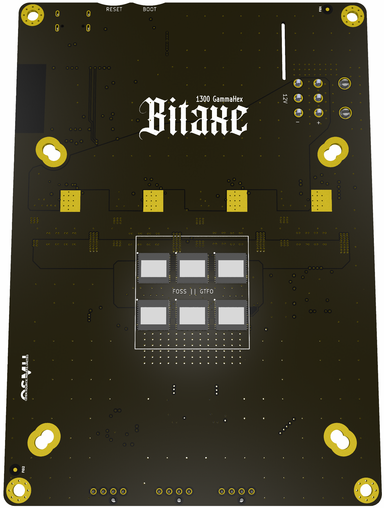

# Bitaxe Gamma Hex

Bitaxe Gamma Hex 1300 is a 6x BM1370 Open Source Bitcoin miner using [esp-miner](https://github.com/bitaxeorg/esp-miner). This project aims to provide a high-performance, energy-efficient Bitcoin mining solution using modern ASIC hardware.



## Features

- 1.9 inch color LCD for mining stats.
- ESP32-S3 WiFi microcontroller with full [esp-miner](https://github.com/bitaxeorg/esp-miner) support.
- 12V Input via 6-pin molex.
- Six BM1370 arranged as 2 domains of 3 ASICs ech.
- Four phase TPS546D24S Voltage regulator with adjustable output and live telemetry.
- 12V Bitaxe Accessory Port
- EMC2103 Fan Controller and dual ASIC temp monitor.

## Contributing

BitaxeGammaHex is designed with [KiCad](https://kicad.org) open source PCB design suite. To contribute, follow these steps:

1. Fork the repository.
2. Create a new branch for your feature or bug fix:
   ```bash
   git checkout -b feature/your-feature-name
   ```
3. Make your changes and commit them:
   ```bash
   git commit -m "Add your commit message here"
   ```
4. Push your changes to your fork:
   ```bash
   git push origin feature/your-feature-name
   ```
5. Create a pull request on the main repository.

## License

This project is licensed under the CERN-OHL-2-S License - see the [LICENSE](LICENSE) file for details.

## Acknowledgments

We would like to acknowledge the following projects and individuals for their contributions to the Bitaxe Gamma Hex:

- [esp-miner](https://github.com/bitaxeorg/esp-miner) for the mining firmware.
- The [Open Source Miners United](https://osmu.xyz) community for their support and contributions.
